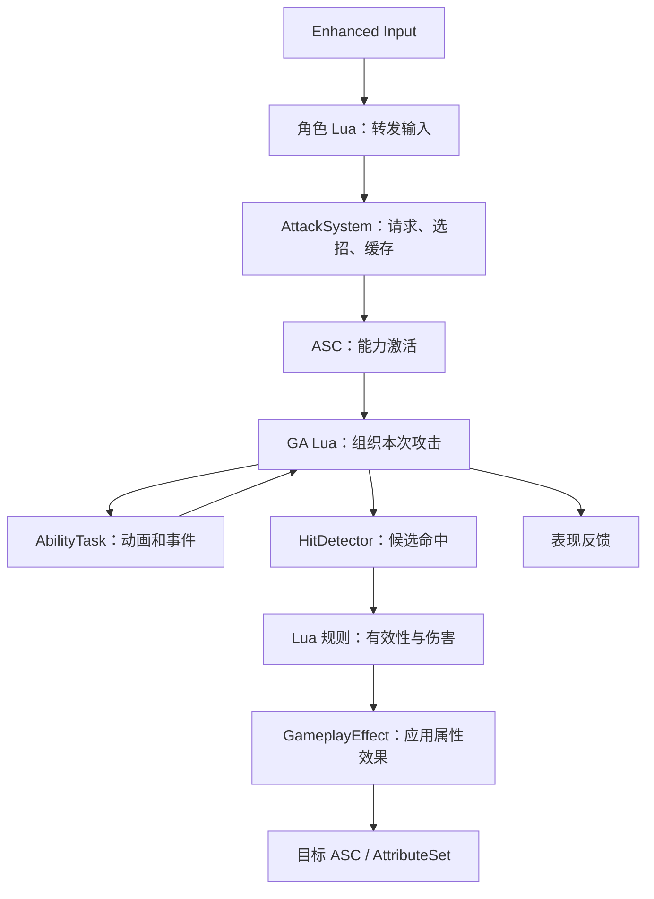

# GAS 学习文档

> 面向 Assassin 项目：UE 5.7、UnLua、单机动作战斗。整理日期：2026-09-30。
>
> 本文将官方机制、开发者经验与本项目的设计建议放在一起讲解。标为“建议”“示例”“待实现”的内容不是已经完成的功能；Lua 伪代码用于说明职责，不应直接当成可运行的引擎接口。本文编写期间只新增文档。

## 目录

1. [先建立整体认识](#一先建立整体认识)
2. [GAS 的设计思想](#二gas-的设计思想)
3. [核心对象与容易混淆的概念](#三核心对象与容易混淆的概念)
4. [当前项目做到哪里](#四当前项目做到哪里)
5. [GAS 与 Lua 的职责划分](#五gas-与-lua-的职责划分)
6. [一次攻击的生命周期](#六一次攻击的生命周期)
7. [GameplayTag 的设计](#七gameplaytag-的设计)
8. [动画、AbilityTask 与事件](#八动画abilitytask-与事件)
9. [命中检测与重复伤害](#九命中检测与重复伤害)
10. [伤害计算与 GameplayEffect](#十伤害计算与-gameplayeffect)
11. [消耗、冷却与提交时机](#十一消耗冷却与提交时机)
12. [连招与输入缓存](#十二连招与输入缓存)
13. [打断与生命周期清理](#十三打断与生命周期清理)
14. [实例策略与数据配置](#十四实例策略与数据配置)
15. [调试与排错](#十五调试与排错)
16. [分阶段学习与实现路线](#十六分阶段学习与实现路线)
17. [资料导读与版本差异](#十七资料导读与版本差异)
18. [术语速查与设计自检](#十八术语速查与设计自检)

## 一、先建立整体认识

假设角色按下轻攻击：角色要判断当前能不能攻击，播放动作，在挥刀经过敌人的时候判断命中，扣除生命，播放反馈，最后恢复到能够接受下一次操作的状态。

GAS 为这些事情提供了可组合的基础设施。它不会替项目决定武器轨迹、连招手感、攻击倍率或闪避取消规则。

可以先用一句话记住各自的用途：

| 概念 | 可以怎样理解 | 攻击中的用途 |
| --- | --- | --- |
| ASC：AbilitySystemComponent | 角色的能力与效果管理入口 | 保存已授予能力、请求激活、应用效果、查询状态 |
| GA：GameplayAbility | 一次有开始、有过程、有结束的行为 | 组织一次轻攻击或一整段连招 |
| AbilityTask | 行为过程中的异步工作 | 等待动画完成、等待命中窗口事件 |
| GE：GameplayEffect | 对属性或效果状态的修改规则 | 扣血、消耗能量、增加攻击力 |
| AttributeSet | 有含义的数值集合及其约束 | Health、AttackPower、Defense 等 |
| GameplayTag | 系统之间共用的语义标识 | 正在攻击、死亡、轻攻击分类 |
| GameplayEvent | 带有语义和上下文的瞬时通知 | 动画进入命中窗口、攻击被招架 |
| GameplayCue | 与 GAS 关联的表现反馈 | 命中特效、声音、镜头反馈 |

这些概念之间是协作关系。比如“攻击力”属于属性，“正在攻击”属于状态，“命中敌人”属于事件，“敌人失去生命”属于效果结果。把它们都放进一个函数，会让后续扩展越来越困难。

入门阅读：[Epic：Understanding GAS](https://dev.epicgames.com/documentation/en-us/unreal-engine/understanding-the-unreal-engine-gameplay-ability-system)。

## 二、GAS 的设计思想

### 2.1 将行为、结果与表现分开

本项目建议按下面的边界组织战斗：

- **行为**：我发起了哪一次攻击，动画进行到哪里，是否允许接下一段。
- **判定**：这次攻击在有效窗口内接触了哪些目标。
- **结果**：目标受到多少伤害，是否获得中毒、眩晕等效果。
- **表现**：播放什么声音、特效、受击动画、镜头反馈。

例如，剑击和飞刀可以采用不同的命中检测方法，但共同调用伤害应用入口。暴击伤害可以变化，但不必复制整套挥刀动画逻辑。敌人没有播放器音效，也应当能正常扣血。

这样划分之后，修改“剑变成匕首”主要影响动作与命中配置；修改“护甲算法”主要影响伤害规则；修改“命中特效”主要影响表现。

### 2.2 用语义连接系统，减少对具体类的依赖

如果闪避系统逐一检查轻攻击 GA、重攻击 GA、刺杀 GA 的具体类型，每增加一个技能都可能要修改闪避代码。

更容易维护的方式是先表达规则：哪些动作属于攻击类，哪些攻击阶段允许闪避取消，哪些状态禁止闪避。Tag 负责公开语义；精细的窗口与跳转仍由战斗逻辑决定。

注意：Tag 是规则的标识。只有配置了条件、取消关系或对应处理逻辑，它才会影响行为。给某个对象贴上 `Dead` 名字，不会自动实现死亡流程。

### 2.3 同一份状态要有明确的负责人

建议让每种状态只有一个写入入口：

| 状态或数据 | 建议的负责人 |
| --- | --- |
| 已授予能力、活动效果 | ASC |
| 本次攻击任务、命中窗口、攻击执行编号 | 当前 GA 及其执行上下文 |
| 连招段数、待消费输入、武器到攻击的选择 | AttackSystem |
| Health 等属性的边界约束 | AttributeSet |
| 伤害公式 | 独立的 Lua 伤害规则模块 |
| 特效的生成和回收 | 表现模块或 GameplayCue |

例如，不应让角色 Lua、AttackSystem 和 GA 各自维护一个独立的 `ComboIndex`。它们很容易在攻击失败或被打断后出现不同步。

### 2.4 不同机制解决不同粒度的问题

建议的分工是：

- **Tag**：表达“死亡、眩晕、攻击中”等跨模块共享状态。
- **Lua 执行状态**：表达“前摇、有效判定、后摇、允许衔接”等精细阶段。
- **动画事件**：通知阶段切换时机。
- **配置数据**：描述倍率、动画段、窗口策略和武器差异。

不必把每个内部变量都变成 Tag，也不必把所有阶段都塞进一个全局状态机。需要其他系统查询或参与规则的状态，才值得公开。

### 2.5 选择需要的 GAS 功能

本项目是单机游戏，第一阶段重点是生命周期、属性效果、状态规则和异步任务。网络预测、复杂 TargetData 复制、RPC 批处理可以后置。

Epic 的 Action RPG 示例也明确采用了 GAS 的一部分能力，并对目标选择做了项目自己的实现。它提供的是可以裁剪的实践参考。[Epic：Gameplay Abilities in Action RPG](https://dev.epicgames.com/documentation/en-us/unreal-engine/gameplay-abilities-in-action-rpg?application_version=4.27)

## 三、核心对象与容易混淆的概念

### 3.1 GA 资源、授予记录与执行实例

看到 `GA_LightAttack` 时，要分清三个层次：

1. **能力类或资源**：描述这类攻击的默认配置和执行代码。
2. **授予记录（FGameplayAbilitySpec）**：表示某个 ASC 拥有该能力，包含等级等信息。
3. **执行实例**：按实例策略参与实际执行的 UObject。

加载 GA 类并不等于角色已经拥有它。授予成功也不等于攻击已经开始。一次激活返回成功，更不等于已经命中或扣血。

### 3.2 两种常见 Handle

| Handle | 用途 | 不代表什么 |
| --- | --- | --- |
| FGameplayAbilitySpecHandle | 找到某次能力授予记录，用于后续管理 | 不代表本次攻击命中的目标 |
| FActiveGameplayEffectHandle | 管理一个活动中的效果，例如移除持续效果 | 不代表一笔即时伤害会一直保留在活动效果列表中 |

不要混用能力句柄和效果句柄。也不要只因 Lua 收到了一个 userdata，就断言底层句柄有效；应核对当前绑定层支持的有效性检查。

### 3.3 GE 定义与 GE Spec

GE 资源是效果的模板；`GameplayEffectSpec` 是某次应用效果时携带的参数。

本项目可以让多个攻击共用一个伤害 GE，每次命中创建自己的 Spec，再传入本次伤害。避免为了改变伤害值而直接改共享资源的默认对象。

官方说明了 GE、Spec、持续时间与活动效果容器的关系。[Epic：Gameplay Effects](https://dev.epicgames.com/documentation/en-us/unreal-engine/gameplay-effects-for-the-gameplay-ability-system-in-unreal-engine?application_version=5.7)

### 3.4 Attribute 的 BaseValue、CurrentValue、MaxHealth

属性的基础值与当前值不是同一个概念；当前值会受到活动效果等因素影响。`MaxHealth` 是另外一个属性，不能把 Health 的 BaseValue 当成生命上限。

学习时先用两个场景辨别：

- 受到一笔即时伤害，生命数值发生变化。
- 获得一个限时攻击力加成，加成结束后恢复原来的效果状态。

它们的持续时间和计算方式不同，不能都用“修改变量后过几秒再改回来”处理。[Epic：Gameplay Attributes and Attribute Sets](https://dev.epicgames.com/documentation/en-us/unreal-engine/gameplay-attributes-and-attribute-sets-for-the-gameplay-ability-system-in-unreal-engine?application_version=5.7)

### 3.5 OwnerActor 与 AvatarActor

ASC 的所有者与能力实际作用的角色不一定是同一个对象。例如，有的项目把 ASC 放在 PlayerState，让角色死亡重生后仍保留能力状态。

我们的初期方案以当前角色为中心，理解这两个概念即可。需要实际角色、Mesh 或动画实例时，应取正确的 Avatar 上下文，不要默认 ASC 的 Owner 永远就是可见角色。

Lyra 的 PlayerState、Pawn 初始化和能力授予关系可作为这种设计的实例。[Epic：Abilities in Lyra](https://dev.epicgames.com/documentation/en-us/unreal-engine/abilities-in-lyra-in-unreal-engine)

## 四、当前项目做到哪里

以下是整理时读取源码得到的快照，不代表运行验收全部通过。

| 文件 | 当前能看见的内容 | 仍需完成或验证 |
| --- | --- | --- |
| [BP_AssassinGirl.lua](F:/UEGame/Assassin/Content/Script/Character/BP_AssassinGirl.lua) | 在 OnGASInitialized 创建 AttackSystem；轻攻击输入回调转发请求 | 实际按键到回调的完整验证；角色退出时的清理 |
| [AttackSystem.lua](F:/UEGame/Assassin/Content/Script/Combat/AttackSystem.lua) | 获取 ASC、加载轻攻击类、授予轻攻击、请求激活 | 重攻击、输入缓存、连招和更完善的授予有效性检查 |
| [GA_LightAttack.lua](F:/UEGame/Assassin/Content/Script/Abilities/GA_LightAttack.lua) | 激活后 Commit，随后立即 End | 动画、命中窗口、目标检测、伤害和打断清理 |
| [AssassinLuaGameplayAbility.h](F:/UEGame/Assassin/Source/Assassin/AssassinCharacter/Public/AssassinLuaGameplayAbility.h) | 提供 GAS 基类与 UnLua 模块名配置 | 后续桥接能力按实际接口需要增加 |
| [AssassinAttributeSet.h](F:/UEGame/Assassin/Source/Assassin/AssassinCharacter/Public/AssassinAttributeSet.h) | Health、MaxHealth、AttackPower 等 10 个属性 | 不应据此认定伤害链路已完成 |
| [AssassinAttributeSet.cpp](F:/UEGame/Assassin/Source/Assassin/AssassinCharacter/Private/AssassinAttributeSet.cpp) | 属性范围处理和效果执行后的数值约束 | 死亡、受击等 Gameplay 反应仍需明确负责人 |

当前轻攻击代码的核心如下：

```lua
function M:K2_ActivateAbility()
    local Committed = self:K2_CommitAbility()
    if not Committed then
        self:K2_EndAbility()
        return
    end

    self:K2_EndAbility()
end
```

这是生命周期骨架。真实攻击加入异步动画后，不能在启动动画任务后立刻无条件结束能力；结束时机需要由完成、取消、失败等路径决定。

项目现有 Tag 说明见 [AssassinGameplayTags.zh-CN.md](F:/UEGame/Assassin/Docs/AssassinGameplayTags.zh-CN.md)。本文提出的新窗口事件或 Cue 名称，除明确列为现有的之外，都只是设计建议。

## 五、GAS 与 Lua 的职责划分

### 5.1 建议的调用关系



这是后续设计图，HitDetector 等模块还没有在当前代码中完成。

### 5.2 角色 Lua 保持轻量

角色 Lua 适合处理：初始化、接收角色层事件、转发输入、结束时释放所属模块。

例如现有入口：

```lua
function M:OnLightAttackStarted()
    if self.AttackSystem then
        self.AttackSystem:LightAttack()
    end
end
```

不要让角色文件逐渐承担所有武器倍率、Trace、连招和音效选择。否则玩家、AI 和不同角色会难以共享攻击规则。

### 5.3 AttackSystem 负责攻击请求与跨攻击数据

建议负责：

- 根据武器和输入类型选择攻击。
- 管理 ComboIndex、输入缓存和衔接策略。
- 通过 ASC 请求激活；记录请求成功或失败。
- 接收 GA 的阶段、完成与取消通知。

授予能力可以暂时由当前模块负责。以后有换武器、角色能力集合时，再抽出统一的能力授予管理；不要先做没有使用场景的复杂框架。

### 5.4 GA Lua 负责当前攻击的执行

建议负责：提交消耗，建立本次执行上下文，开启动画与事件任务，在有效时机请求检测和伤害，最后统一清理。

GA 不应再次独立维护一套与 AttackSystem 冲突的连招状态。它可以持有“本次选中的段数”这种快照，并通过约定的接口请求 AttackSystem 转移到下一段。

### 5.5 C++ 桥接与资源各自的作用

“Gameplay 逻辑写在 Lua”仍需要引擎侧的 UCLASS、反射接口和资源配置：

- C++ 提供引擎类型、AttributeSet、Lua 绑定、必要的委托或非反射接口包装。
- Lua 决定选招、攻击阶段、输入缓存、命中规则和伤害公式。
- 蓝图与数据资源配置 GA 默认值、GE、动画、输入资产等。

现有 `UAssassinLuaGameplayAbility` 只返回 Lua 模块名，没有实现攻击规则。UnLua 官方支持通过接口绑定模块，并覆盖引擎可覆盖的事件；并非所有 C++ 虚函数都能直接由 Lua 重写。[UnLua 官方编程指南](https://github.com/Tencent/UnLua/blob/master/Docs/CN/UnLua_Programming_Guide.md)

**新增 Lua 调用前的检查顺序**：本地头文件声明 → 反射或静态导出情况 → 参数与返回值 → 最小运行验证。蓝图节点的显示名不一定是 Lua 中的函数名。本文中的 `K2_ActivateAbility`、`K2_CommitAbility`、`K2_EndAbility` 来自当前项目代码；其他示意接口需另行实现。

## 六、一次攻击的生命周期

### 6.1 从请求到结束

```text
角色初始化 GAS
  → 授予轻攻击能力（初始化阶段）
玩家发出攻击请求
  → AttackSystem 选择攻击并请求 ASC 激活
  → GAS 检查激活条件
  → GA 开始执行
  → Commit 成功
  → 播放动作并等待阶段事件
  → 有效窗口内检测目标、应用效果
  → 动作结束或攻击被取消
  → 清理本次执行数据
  → 能力结束
```

官方将授予、尝试激活、提交与结束区分开来。尤其是 EndAbility：正常完成需要开发者安排结束，否则系统可能仍认为能力正在运行。[Epic：Gameplay Ability](https://dev.epicgames.com/documentation/en-us/unreal-engine/using-gameplay-abilities-in-unreal-engine?application_version=5.7)

### 6.2 四种“成功”不能混用

| 观察结果 | 能证明的事情 | 不能证明的事情 |
| --- | --- | --- |
| GiveAbility 返回有效句柄 | 角色取得该能力的授予记录 | 输入有效、攻击已经执行 |
| TryActivate 返回成功 | 激活请求被接受 | Commit 成功、动画可播、命中目标 |
| Commit 成功 | 配置的提交规则通过并执行 | 挥刀碰到了敌人 |
| 目标 Health 变化 | 属性结果发生变化 | 动画时机、重复命中和取消逻辑都正确 |

调试和日志要把这些结果分别记录。否则一句“攻击成功”无法告诉我们失败发生在哪一层。

### 6.3 从第一天就设计退出路径

本项目建议至少列出：

1. Commit 失败。
2. 动画资源或动画上下文无效。
3. 正常播放完成。
4. 被其他动作打断。
5. 角色死亡、被销毁或失去有效上下文。

每条路径都要明确：如何停止判定、如何解绑监听、如何通知 AttackSystem、如何结束能力。攻击实现不能只有“开始”函数。

初始化重复回调也要考虑：避免重复创建模块和重复授予能力。当前 `if self.LightAttackAbilityHandle then` 是简单的记录检查；以后能力被移除后，该字段仍可能保留，需要同步清除或检查授予记录。

## 七、GameplayTag 的设计

### 7.1 分类、状态、事件、数据分别命名

以下是项目已有标识：

| Tag | 语义 | 使用时的思考 |
| --- | --- | --- |
| Assassin.Ability.Attack.Light | 轻攻击能力分类 | 用于识别或筛选能力 |
| Assassin.State.Attacking | 当前正在攻击 | 需要有明确添加与移除生命周期 |
| Assassin.State.Dead | 死亡状态 | 用于激活限制及死亡流程协作 |
| Assassin.State.Stunned | 眩晕状态 | 与眩晕效果和攻击取消规则协作 |
| Assassin.Event.Attack.Hit | 攻击命中事件 | 表达某次事实，而非持续拥有的状态 |
| Assassin.Data.Damage | 伤害数值标识 | 可作为 SetByCaller 的键 |
| Assassin.Damage.Physical | 物理伤害类型 | 分类用途，不会自己产生伤害计算 |

`Event.Attack.Hit` 这个名称需要继续约定：它表示“碰到候选目标”，还是“伤害已经应用”。建议选定一种语义，避免不同模块误解同一事件。

### 7.2 能力分类 Tag 不等于角色持有 Tag

能力资源上的分类标识用于描述该能力；它不会仅因为角色拥有这个能力，就自动变成角色的持续状态。

“正在攻击”建议由攻击能力的 Activation Owned Tags 管理。死亡、眩晕作为 Activation Blocked Tags 可以限制新攻击。已经开始的攻击要被眩晕打断，还需要取消配置或显式取消流程；禁止开始和取消正在执行是两个规则。[Epic：Gameplay Ability 的 Tags 部分](https://dev.epicgames.com/documentation/en-us/unreal-engine/using-gameplay-abilities-in-unreal-engine?application_version=5.7#tags)

### 7.3 层级匹配与精确匹配

Tag 的父子结构具有语义：轻攻击属于攻击类。因此查询 `Assassin.Ability.Attack` 可以用于表示整个攻击类别，但是否包含子 Tag 要看调用使用的匹配方式。

实现时明确：

- 查询所有攻击类型：通常需要层级匹配。
- 等待某一个精确阶段事件：通常需要检查精确匹配配置。
- 使用 Tag Container：确认要求“任一匹配”还是“全部匹配”。

不要用普通字符串前缀判断替代 GameplayTag 的匹配接口。[Epic：Using Gameplay Tags](https://dev.epicgames.com/documentation/en-us/unreal-engine/using-gameplay-tags-in-unreal-engine?application_version=5.7)

### 7.4 状态的生命周期比名字更重要

添加 Tag 前写下四个问题：谁添加、谁移除、能否重叠、被打断时怎样移除。

例如，两项来源都能提供无敌时，某项结束不能把另一项仍有效的无敌状态一起清空。持续效果提供的状态尽量由对应效果生命周期管理；手工 Loose Tag 则需要调用方明确维护。

**后续窗口事件命名建议，尚未在本次文档中注册**：

```text
Assassin.Event.Attack.HitWindow.Open
Assassin.Event.Attack.HitWindow.Close
Assassin.Event.Attack.ComboWindow.Open
Assassin.Event.Attack.ComboWindow.Close
```

是否采用这些名字，应与现有事件语义一并确定。事件发生不会自动让角色持续持有对应 Tag。

## 八、动画、AbilityTask 与事件

### 8.1 让动作提供时机，让 Gameplay 决定结果

建议由动画通知表达“现在进入有效判定窗口”，由 GA 决定如何检测目标和应用效果。

动画通知里直接扣血会让多个动作复制规则，也会把攻击力、无敌、防御等判断耦合进动画资源。动画资源适合描述时机，战斗模块适合决定结果。

### 8.2 三个窗口各自解决什么问题

| 窗口 | 作用 | 是否必须重合 |
| --- | --- | --- |
| 命中窗口 | 允许武器判定造成命中 | 不必与连招窗口重合 |
| 连招窗口 | 允许接受或消费下一段输入 | 可以在后摇前后开放 |
| 取消窗口 | 允许闪避或其他动作中断攻击 | 应按动作设计决定 |

例如，一刀已经经过目标、命中窗口关闭，但仍处于后摇；此时可以开放连招窗口，让玩家提前输入下一段。把三个窗口合并成一个 `bCanAttack`，会限制手感调整。

### 8.3 AbilityTask 为什么适合攻击

AbilityTask 组织跨帧等待，能通过委托把结果返回给能力，并受能力生命周期约束。它适合播放动作和等待事件，不必让 GA 每帧轮询所有条件。[Epic：Ability Tasks](https://dev.epicgames.com/documentation/en-us/unreal-engine/gameplay-ability-tasks-in-unreal-engine?application_version=5.7)

先辨认两个内置任务：

- [PlayMontageAndWait](https://dev.epicgames.com/documentation/en-us/unreal-engine/API/Plugins/GameplayAbilities/UAbilityTask_PlayMontageAndWait)：播放蒙太奇，提供完成、混出、打断、取消等回调。
- [WaitGameplayEvent](https://dev.epicgames.com/documentation/en-us/unreal-engine/API/Plugins/GameplayAbilities/UAbilityTask_WaitGameplayEvent)：等待指定事件，有精确匹配和只触发一次等选项。

API 页面可能默认显示比项目更新的版本，函数参数以本地 UE 5.7 头文件为准。

### 8.4 不要误把示例自定义任务当作内置节点

教程中的 `PlayMontageAndWaitForEvent` 往往来自示例项目，结合了动画等待和 GameplayEvent 监听。不能因为教程图里有这个节点，就假设当前工程已经存在。

tranek 示例解释了这种组合及任务委托的组织方式。[GASDocumentation：Ability Tasks](https://github.com/tranek/GASDocumentation#concepts-at)

我们的实现可先组合内置任务，只有在接口与清理重复出现时再封装专用任务。选择依据是减少重复和统一正确行为。

### 8.5 Lua 使用任务时要特别验证

蓝图异步任务节点会做一些自动处理；Lua 调用工厂函数后，需要核对是否要显式激活任务、如何绑定委托，以及对象是否被正确持有。

建议顺序：建立事件监听 → 绑定回调 → 启动动画。这样可以降低错过动画开始阶段事件的风险。任务引用、委托、UObject 有效性都要按本地 UnLua 版本核验，不能以“Lua table 里还有字段”推断引擎对象必然有效。

### 8.6 动画事件不是唯一的退出保障

混出、停止、跳段、取消等情况可能让预期的通知没有按理想路径发生。因此即便使用 NotifyState 的 Begin/End，仍要在能力结束时强制关闭命中窗口。

还要明确：混出回调是否就是本项目的完成点？是否允许在动画仍有残余混合时开始下一动作？这些是战斗设计选择，不能把所有回调都当成完全相同的“结束”。

## 九、命中检测与重复伤害

### 9.1 GAS 不决定武器怎样碰到目标

球体或胶囊 Trace、武器轨迹 Sweep、Overlap、投射物碰撞都可以产生候选命中。选择哪种方式，要看动作速度、武器长度和玩法要求。

建议最初用可视化的简单范围检测验证链路，随后再改成与武器动作匹配的检测。不要在扣血链路尚未验证时，同时引入复杂轨迹、锁定和攻击吸附。

Lyra 的 GA_Melee 使用前方胶囊检测，并检查目标是否满足攻击规则，然后应用伤害 GE。可以学习它的处理顺序，但那套检测范围不一定适合我们的挥剑动作。[Epic：Lyra GA_Melee](https://dev.epicgames.com/documentation/en-us/unreal-engine/abilities-in-lyra-in-unreal-engine)

### 9.2 候选碰撞不等于有效命中

建议在应用伤害之前依次判断：

1. 当前攻击和命中窗口是否仍有效。
2. 是否为自己、无效对象或不参与战斗的对象。
3. 是否存在目标 ASC 与必要属性。
4. 是否符合敌我、死亡、无敌、距离、遮挡等本项目规则。
5. 是否已在本次挥击中处理过该目标。
6. 计算并应用效果，记录结果，触发表现。

第一版不必实现所有玩法规则，但要为它们安排清晰的位置。比如目标是否无敌应该集中判断，避免剑、飞刀和刺杀各有一套互相矛盾的规则。

### 9.3 去重范围应当是一挥或一个伤害窗口

武器连续多帧碰到同一个角色，或同时碰到其多个碰撞组件时，通常只应造成一次普通挥击伤害。

建议为本次执行保存：

```text
AttackExecutionId：这次攻击的编号
SwingId：本次挥击或连招段编号
HitTargets：这一挥已经处理的目标集合
```

推荐流程：

```text
进入新挥击的命中窗口
  → 根据本段规则创建或重置命中集合
窗口内执行检测
  → 将组件命中归并到目标 Actor
  → 已处理目标跳过
  → 新目标做有效性判定并应用结果
关闭窗口
  → 停止检测
```

不要每一帧清空集合，否则会每帧扣血；也不要整套三连击只使用一个永不重置的集合，否则第二、第三刀可能无法伤害同一敌人。

对于旋风斩、持续光束等技能，可以明确允许定时重复命中，并改用“目标与上次命中时间”的规则。去重策略应该由技能设计决定。

### 9.4 明确什么情况会占用一次命中机会

目标无敌时，这一挥是否还允许在无敌结束后再次命中？盾牌挡住后是否算本次挥击已经接触目标？

建议先写规则，再决定何时把目标加入集合。可以区分“已接触目标”与“已造成伤害目标”，但仅在两者确实需要不同处理时拆开。

### 9.5 快速武器与帧率

只看当前帧武器位置，会漏掉两帧之间经过的目标。使用前后帧位置做 Sweep 可以改善这种问题，但复杂旋转轨迹仍可能需要多个采样点或子步检测。

验收时至少查看正常帧率与较低帧率下的可视化轨迹、命中次数和攻击有效时间。不要直接把检测次数当伤害倍率；普通挥击的一次伤害不应该因为帧率变化而翻倍。

## 十、伤害计算与 GameplayEffect

### 10.1 分开“算多少”与“怎样应用”

建议的第一版链路：

```text
GA 获得有效目标
  → Lua 伤害规则读取攻击方和目标属性
  → 得到最终伤害及暴击等结果
  → 创建伤害 GE 的 Spec
  → 通过 SetByCaller 传入本次伤害
  → 将 Spec 应用到目标 ASC
  → AttributeSet 处理属性边界
  → 观察结果并播放受击反馈
```

这样可以保持伤害公式在 Lua，同时借助 GAS 管理属性效果。不要在普通攻击中直接给 `AttributeSet.Health` 赋值，再假定这等价于完整的 GAS 效果执行。

### 10.2 SetByCaller 的用途

SetByCaller 是放在某次 GE Spec 上的数值参数。本项目已有 `Assassin.Data.Damage`，可以作为伤害参数键。GE 的 Modifier 与写入 Spec 的键必须一致。

tranek 特别提醒：Modifier 使用了某个 SetByCaller 键，但 Spec 没有提供它时，可能出现运行警告或错误并得到 0；键和数值写入不能遗漏。[GASDocumentation：SetByCallers](https://github.com/tranek/GASDocumentation#concepts-ge-spec-setbycaller)

建议为第一版确定唯一的符号约定：

- Lua 的 `FinalDamage` 总是非负数。
- 如果 GE 直接以 Additive 修改 Health，则写入用于 Health 修改的数值为 `-FinalDamage`。
- 如果以后改为 IncomingDamage 中转，则通常传正伤害，再由接收侧扣血。

不要一处传负数、另一处再次取负，导致伤害变成治疗。具体采用哪种方案，应与 GE 的 Modifier 配置一起验证。

### 10.3 一个可用于练习的 Lua 公式

下面是本文为练习提出的公式，不是项目已经确定的战斗平衡：

```text
未暴击伤害 = max(0, AttackPower × AttackMultiplier - Defense)
暴击伤害 = 未暴击伤害 × (1 + CritDamageBonus)
```

例如 AttackPower=100、倍率=1.2、Defense=20，则未暴击伤害为 100。若 CritDamageBonus=0.5，暴击伤害为 150。

优点是容易观察；缺点是防御较高时可能归零。以后可以改为比例减伤，但修改之前应先确定体验目标：高防御目标是否允许普通攻击打不动？是否有最低伤害？刺杀是否忽略防御？

以下纯 Lua 函数只做计算，不调用 UE，便于理解输入与输出：

```lua
-- 示例公式；不是现有 DamageCalculator 模块。
-- 输入随机样本 Random01，方便复现暴击结果；由调用方提供 [0, 1) 的数值。
local function CalculateDamage(Source, Target, AttackMultiplier, Random01)
    assert(Random01 >= 0 and Random01 < 1)

    local AttackPower = math.max(0, Source.AttackPower)
    local Defense = math.max(0, Target.Defense)
    local Multiplier = math.max(0, AttackMultiplier)
    local CritChance = math.min(1, math.max(0, Source.CritChance))
    local CritBonus = math.max(0, Source.CritDamageBonus)

    local Damage = math.max(0, AttackPower * Multiplier - Defense)
    local IsCritical = Random01 < CritChance
    if IsCritical then
        Damage = Damage * (1 + CritBonus)
    end

    return { Damage = Damage, IsCritical = IsCritical }
end
```

注意当前属性源码对 CritChance 只约束了非负值，没有把上限固定为 1。上例按概率语义将其约束到 [0,1]，属于练习规则，不代表本文修改了 AttributeSet。

### 10.4 何时读取属性是一项设计选择

建议第一版选择“命中时读取属性并立即计算”，并记录来源、目标与攻击段配置。

以后可以讨论其他需求：蓄力开始时固定攻击力，发射时固定飞刀伤害，持续毒伤随当前增益变化。这些需求决定数据需要在什么时刻保存。

Lua 主动读取数值的时机，与 GE 捕获属性时的 Snapshot 配置是两个层面。不要只因为使用了 Spec，就认为所有伤害参数都自动采用同一个时间点。

### 10.5 直接修改 Health 与伤害中转属性

| 方案 | 适合什么阶段 | 代价 |
| --- | --- | --- |
| 即时 GE 直接修改 Health | 第一版单一生命系统，先打通扣血 | 护盾、吸收和多种受伤分配规则要额外组织 |
| IncomingDamage 等中转属性 | 出现护盾、吸收、统一受伤结算需求 | 增加属性和接收侧处理，需要明确消费与归零 |

中转属性是一种可选设计。当前项目没有 IncomingDamage 属性，不能直接照抄教程引用它。若引入中转属性，建议 Lua 仍负责公式，原生属性层负责稳定的数值约束或必要桥接，Gameplay 反应经事件传回 Lua。

学习这种分离思想可参考 [GASDocumentation：Meta Attributes](https://github.com/tranek/GASDocumentation#concepts-a-meta)。

### 10.6 UI、受击与死亡各自监听什么

建议：

- UI 监听真实的属性变化，不依靠“攻击按钮被按下”估计敌人扣了多少血。
- 受击反馈拿到本次命中结果，包括是否暴击、是否被防御、命中位置。
- 死亡模块确保死亡状态和死亡流程只进入一次，取消动作、关闭判定，再处理动画等反应。

进入命中回调后，目标可能在处理伤害时被销毁。后续访问目标、播放附着特效之前仍要检查有效性。

### 10.7 最小伤害 GE 配置练习

下面是后续可操作的学习任务。资源名 `GE_AttackDamage` 是建议名，本文没有创建该资源。

1. 创建继承 GameplayEffect 的效果资源，设为 **Instant**。
2. 添加一个 Modifier，目标属性选本项目的 **Health**。
3. Modifier Op 选 **Additive**。
4. Magnitude 的计算类型选 **SetByCaller**，使用 Tag 键 `Assassin.Data.Damage`；具体面板位置以 UE5.7 为准。
5. 在调用方为这次命中创建新的 Spec，明确 Level 与效果 Context。
6. 按前面约定写入 **-10**，然后应用到测试目标的 ASC。
7. 记录目标 Health 前后值；验证完固定数值后，再改为 `-Result.Damage`。

Context 至少要有可追溯的来源信息；存在武器 Actor 时，按项目约定设置 Instigator、EffectCauser 等信息。不要把玩家和敌人的 ASC 传反，也不要把来源 Context 当成目标 ASC。

| 用例 | 前提 | 应观察的结果 |
| --- | --- | --- |
| 固定扣血 | Health=100，无其他效果干预 | 一次应用后变为 90 |
| 低血量 | Health=5，仍应用 -10 | 最终 Health 受范围约束，不低于 0 |
| 键遗漏 | 不给 Spec 写入要求的参数 | 能定位参数缺失，不能把零伤害误判为成功 |
| 空挥 | 未得到有效目标 | 不创建或不应用目标伤害效果 |
| 同挥重复碰撞 | 连续检测同一个目标 | 只允许约定的一次伤害应用 |

这项练习的目的，是把“GE 配置正确”和“命中系统正确”分别验证。暂时可以通过专用调试入口应用固定效果，随后将入口接回正式 GA；避免在生产逻辑里保留两条并行的扣血路径。

## 十一、消耗、冷却与提交时机

### 11.1 CanActivate 与 Commit 分别负责什么

可以把前者理解为“目前是否允许开始”，后者理解为“执行本次配置的消耗与冷却提交”。两者之间可能有状态变化，因此不要只做一次外部检查后就假定提交一定成功。

当前 GA Lua 已检查 `K2_CommitAbility()` 的返回值。后续增加动画时应保留这个失败分支。

### 11.2 不同提交时机对应不同玩法

本文建议先用“攻击开始时提交”，让规则最容易观察。其他方案需要明确设计：

| 提交时机 | 玩家体验 | 需要额外说明 |
| --- | --- | --- |
| 开始攻击 | 空挥也消耗；中断后通常不自动返还 | 是否存在特定返还规则 |
| 释放蓄力攻击 | 蓄力阶段可以取消 | 长时间蓄力后资源不足怎么办 |
| 有效命中 | 空挥不消耗 | 多目标命中是否只提交一次；提交失败是否还允许造成伤害 |

Commit 不提供项目自定义意义上的自动退款。要返还资源时，必须写明触发条件和返还金额，并防止重复返还。

### 11.3 基础轻攻击是否需要冷却

建议优先用能力生命周期与动作衔接规则控制轻攻击节奏。只有确实存在“动作结束后还要等待”的设计，才增加对应冷却。

否则会出现动画允许衔接，冷却却禁止下一段的冲突。重攻击、技能和道具可以采用自己的消耗与冷却策略，不需要全部统一成相同参数。

## 十二、连招与输入缓存

### 12.1 连招首先是一个输入时机问题

把 ComboIndex 从 1 加到 2，只解决了编号变化。真正要回答的是：什么时候记住输入、什么时候消费、何时转段、输入何时过期、被打断后怎样复位。

本项目建议由 AttackSystem 管理：

```text
ComboIndex：当前正式进入的段数
PendingAttack：最多一个尚未消费的攻击请求
ExpireAt：缓存截止时间
CanAcceptCombo / CanTransition：本阶段的衔接规则
AttackExecutionId：用于识别这一轮有效执行
```

时间字段应使用一致的游戏时间来源。本文建议缓存随游戏暂停停止计时；慢动作下是跟随游戏时间还是按真实时间过期，要单独约定。

### 12.2 两种常见结构

| 结构 | 做法 | 优点 | 需要处理的问题 |
| --- | --- | --- | --- |
| 一次 GA 执行整个连招链 | GA 活动期间按规则切换 Montage Section 或段配置 | 连续动作与任务容易集中管理 | 每段的命中集合、消耗和阶段必须区分 |
| 每段是一次 GA 执行 | 第一段结束后，由 AttackSystem 请求第二段 | 每段可以独立配置 | 激活失败、结束到下一段的间隔、状态交接更复杂 |

**建议第一版采用一个轻攻击 GA 执行固定三段连招链**，用少量配置说明每段动画和倍率。等不同武器确实需要独立能力时再比较第二种结构。

这是本项目的实现建议，并非 GAS 规定的唯一方式。

### 12.3 正在攻击时，新输入该去哪

如果 `Assassin.State.Attacking` 阻止新攻击激活，玩家在第一刀期间再次按键，就不能简单地再调用一次 TryActivate。

推荐路由：

```text
没有活动攻击：请求激活第一段
有活动攻击且允许缓存：记录下一次输入
允许衔接且缓存有效：消费输入，正式进入下一段
不允许缓存或输入已过期：不衔接
攻击结束或被打断：复位对应状态
```

全局不能攻击的状态（例如死亡、眩晕）先处理，再决定当前输入是开始请求还是连招请求。不要让一个粗略的“攻击中就拒绝全部输入”检查把连招缓存也拦掉。

### 12.4 缓存容量与过期

建议初期只缓存一次输入。连按十次不应该让角色在玩家停手后继续自动执行十刀。

例如仅用于调试的设定：第一段后摇开放衔接；输入缓存有效 0.15 秒。玩家在衔接点前 0.10 秒按下，可以消费；提前很久按下则过期。这里的数值只是练习起点，最终按动画与体验调整。

**消费顺序建议**：取出并清除缓存 → 请求转段 → 成功后更新 ComboIndex。不要先把段数加一，再发现动画或激活失败；如果必须提前预选段数，就将“预选”与“正式进入”分开记录。

### 12.5 防止上一轮回调影响下一轮

可以用递增的 AttackExecutionId：异步回调保存创建时的编号，处理前检查它是否仍属于活动攻击。取消旧攻击后，迟到的旧回调就不应打开新攻击的命中窗口。

编号检查用于防止逻辑串线，不能代替解除监听、结束任务和检查 UObject 有效性。

## 十三、打断与生命周期清理

### 13.1 先列规则矩阵

以下是待评审的设计例子，不是当前项目已配置行为：

| 当前阶段 | 轻攻击输入 | 闪避输入 | 被眩晕 | 死亡 |
| --- | --- | --- | --- | --- |
| 前摇 | 按规则缓存 | 按动作决定是否允许取消 | 取消攻击 | 结束攻击并进入死亡 |
| 命中窗口 | 缓存下一段 | 通常关闭，或特殊动作允许 | 立即停止判定并取消 | 立即停止判定 |
| 后摇 | 消费有效缓存 | 可设计为允许取消 | 取消并清空缓存 | 清理后进入死亡 |
| 攻击结束 | 请求新攻击 | 正常请求闪避 | 按眩晕规则禁止动作 | 按死亡规则禁止动作 |

用这种表格讨论手感，比在多个函数里临时加 if 更容易发现冲突。特殊霸体动作也应在规则里体现，不能靠偶然没有收到取消事件来实现。

### 13.2 清理要覆盖引擎对象和 Lua 状态

建议统一清理函数处理：

- 停止本次攻击的 HitDetector，强制关闭窗口。
- 解除本次绑定的监听，清除自己创建的 Timer。
- 释放任务引用；确认任务结束与蒙太奇停止策略一致。
- 清理本挥击命中集合和执行上下文。
- 通知 AttackSystem，按完成或取消原因处理缓存与 ComboIndex。
- 撤销自己添加的临时状态、速度限制或目标引用。

Activation Owned Tags 和能力所属任务可以依靠 GAS 生命周期管理，但普通 Lua 数据、外部 Timer、独立创建对象和自定义检测器仍需要自己的清理策略。

### 13.3 清理函数应能重复调用

动画取消与角色销毁可能先后触发清理。函数执行两次时，不应该再次退款、再次跳段，或扣除别人添加的 Tag 计数。

下面是职责伪代码，所有接口名称都需要项目实现：

```lua
-- 伪代码：不是当前引擎可直接调用的 API。
function AttackContext:Cleanup(Reason)
    if self.Cleaned then
        return
    end
    self.Cleaned = true
    self.HitWindowOpen = false
    self:StopOwnedHitDetection()
    self:ReleaseOwnedListenersAndTimers()
    self:NotifyAttackSystemOnce(Reason)
    self.HitTargets = nil
    self.Target = nil
end
```

真实实现还要防止清理过程中的同步回调再次进入结束流程。`K2_OnEndAbility` 可做项目清理，但不要在这个结束通知中再次无条件调用 EndAbility，形成重复结束或递归。

### 13.4 角色销毁与能力移除

当前角色 Lua 的 ReceiveEndPlay 仍是注释，AttackSystem:Destroy 也只是清空引用。后续应接入已验证的角色结束生命周期，并明确外部任务由谁停止。

能力是否移除取决于 ASC 的所有权：ASC 随角色销毁与 ASC 保存在 PlayerState 是不同情况。若模块负责授予长期存在 ASC 上的能力，模块销毁时还需处理授予记录；仅把 Lua 的句柄字段设成 nil，不会移除 ASC 内的能力。

## 十四、实例策略与数据配置

### 14.1 实例策略会改变状态保存方式

| 策略 | 对象与状态特点 | 本项目需要注意 |
| --- | --- | --- |
| InstancedPerActor | 授予后拥有可复用实例，多次执行会复用状态 | 每次开始重置本轮字段；结束解绑本轮监听 |
| InstancedPerExecution | 每次执行建立实例 | 多次实例不能无约束地争用同一个 AttackSystem |
| NonInstanced | 使用类默认对象，有严格限制 | 不适合我们的 Lua 异步攻击和实例状态 |

这些是 GAS 的实例策略差异。[Epic：Instancing Policy](https://dev.epicgames.com/documentation/en-us/unreal-engine/using-gameplay-abilities-in-unreal-engine?application_version=5.7#instancingpolicy)

普通攻击频繁执行，后续可以优先评估 InstancedPerActor，并明确是否允许重复激活。先保证生命周期正确，再根据实际对象数量和性能决定策略；不要为了优化跳过实例状态管理。

### 14.2 将招式差异放进数据

建议第一版配置至少包含：

| 字段 | 含义 |
| --- | --- |
| AttackId | 可读的招式标识，便于日志定位 |
| Montage / Section | 播放资源与段名 |
| DamageMultiplier | 本段伤害倍率 |
| HitDetectionProfile | 检测方式、Socket、形状或采样配置 |
| ComboTransition | 可接的下一段及条件 |
| CancelPolicy | 哪些阶段可被哪些动作取消 |
| Cost / Cooldown | 明确这两项由 GE 还是配置入口提供 |

可以用 UE 数据资产、数据表或有清晰类型约定的 Lua 配置。选择取决于编辑工作流，不需要同时维护两份含义相同的配置。

如果窗口时机由动画通知定义，就不要再维护一套重复的 Lua 秒数作为正式时机；调整动画播放速率时，两套时机会偏离。秒数可以用于调试、容错或特定技能，但用途必须说明。

### 14.3 资源引用与路径

当前 Lua 使用固定路径加载 GA 类，适合先验证单个能力。随着招式增长，建议把资源引用集中放在可检查的配置中，避免每个函数散落不同字符串。

模块路径 `Abilities.GA_LightAttack` 与资源路径 `/Game/.../GA_LightAttack.GA_LightAttack_C` 含义不同。资源能在编辑器加载也不代表一定被打包收录；只通过字符串引用的资源应在打包阶段核对 Cook 收录策略。

## 十五、调试与排错

### 15.1 按调用链一层层定位

```text
按键
  → Input Action 事件
  → 角色 Lua 回调
  → AttackSystem 请求
  → ASC 接受激活
  → GA Lua 回调
  → Commit
  → 动画任务
  → 命中窗口事件
  → 候选目标与去重
  → GE 应用
  → Health 变化
  → 清理与能力结束
```

先找最后一层有证据的环节，再检查下一层。不要在输入回调完全没有触发时，先修改伤害公式。

### 15.2 日志应该回答什么

建议记录角色、AttackExecutionId、招式、段数和结果。以下只是日志格式示例：

```text
[Combat] actor=Player exec=12 request=Light
[Combat] actor=Player exec=12 activation=accepted
[Combat] actor=Player exec=12 commit=success
[Combat] actor=Player exec=12 section=Light_1 window=open
[Combat] actor=Player exec=12 swing=1 target=Enemy_03 result=hit damage=100
[Combat] actor=Player exec=12 swing=1 target=Enemy_03 result=duplicate_skipped
[Combat] actor=Player exec=12 window=closed
[Combat] actor=Player exec=12 end=completed cleanup=done
```

失败日志至少包含阶段与原因，例如 `activation=blocked state=Stunned`。不要把所有失败都压缩成一个 `false`，但也不需要长期逐帧输出位置数据。

### 15.3 常见症状与检查点

| 症状 | 优先检查 |
| --- | --- |
| 按键后完全没有日志 | 游戏视口焦点、角色控制权、InputComponent、Mapping Context 是否真正添加、Lua 输入绑定 |
| 输入到了角色，但 GA 不执行 | 模块是否存在、ASC 是否有效、能力是否授予、Tag 限制、现有能力是否仍活动 |
| GA 执行但没有动作 | Montage 资源、Mesh/AnimInstance、Slot 接线、任务激活与返回结果 |
| 动作有了但没有窗口事件 | 通知位置、事件发送给哪个 Actor/ASC、Tag 是否匹配、监听是否早于动画启动 |
| Trace 有目标但没有扣血 | 目标 ASC、有效性规则、去重、GE 类、Spec、SetByCaller 键和数值、应用条件 |
| 同一刀扣血多次 | 去重集合每帧被清空、组件未归并到 Actor、同时有两条伤害入口 |
| 第二刀无法再打同一目标 | 去重范围错误地覆盖整个连招，未按新挥击重置 |
| 第二次攻击再也不能开始 | End 路径遗漏、状态残留、冷却未结束、任务或执行字段未重置 |
| 取消后仍能伤害敌人 | 检测器与能力取消没有联动、迟到回调仍被处理 |
| Health 到零后重复死亡 | 死亡入口没有检查是否已进入死亡，多个监听重复启动流程 |

### 15.4 输入系统也要单独理解

Mapping Context 资源中存在一个映射，不代表该 Context 已加入当前本地玩家。还要检查优先级、输入消耗和实际使用的 InputComponent。

`Started` 表示开始评估输入；`Triggered` 表示满足触发要求。简单按键和长按、双击的触发语义不同，不能把 Started 一律视为所有操作已经成功触发。当前轻攻击绑定 Started，需要结合 IA 的实际 Trigger 配置验证。[Epic：Enhanced Input](https://dev.epicgames.com/documentation/en-us/unreal-engine/enhanced-input-in-unreal-engine?application_version=5.7)

单次按下、长按、快速连按、松开，都应分别观察回调次数。否则可能把每帧重复事件误认为玩家连续输入。

### 15.5 属性数值要同时检查约束

如果写入看似正确但最终数值不同，检查属性范围、活动 Buff、GE Modifier、应用条件以及 AttributeSet 的执行回调。

当前源码已有 Health/Adrenaline 与上限的约束。初始化多个关联属性时，观察 MaxHealth 与 Health 的实际结果；不要只看到 GE 的一个配置值就认定初始化最终值正确。

### 15.6 把证据分成三类

- **源码存在**：函数或资源配置已经写入。
- **运行观察**：在 PIE 中看到对应回调或数值变化。
- **行为验收**：不同路径下，行为符合设计且能够重复执行。

本文“当前项目做到哪里”主要属于源码观察。以后工作记录应写清楚证据层级，例如“第二次攻击正常”“取消后无伤害”，而不是只有“GAS 已完成”。

## 十六、分阶段学习与实现路线

每阶段只扩展一个主要链路，前一阶段有可观察结果再继续。下面是建议路线，尚未执行这些后续实现。

### 阶段 1：输入、授予与生命周期

**学习**：GiveAbility、TryActivate、Commit、End 的关系，UnLua 模块绑定。

**练习**：从实际输入调用轻攻击，让 GA 进入并结束；临时输出阶段日志。

**验收**：

- 一次按下对应预期次数的请求。
- 初始化重复进入不重复授予能力。
- 第一、第二、第三次请求都能正常执行和结束。
- 主动制造资源不足或阻止 Tag 时，失败路径能解释原因。

### 阶段 2：单次攻击动画

**学习**：AbilityTask、Montage Slot、完成与取消回调。

**练习**：只播放一段轻攻击，动画结束后结束 GA；暂不扣血。

**验收**：正常播完、资源无效、主动停止和打断都能退出。确认实际结束时机，能够再次攻击。

### 阶段 3：窗口与检测

**学习**：动画通知、GameplayEvent、命中集合的生命周期。

**练习**：窗口内画出检测范围并记录目标；窗口外停止检测。

**验收**：

- 一挥碰到目标多个组件只记录一次。
- 下一挥可以再次命中同一个目标。
- 取消发生在窗口内时，检测立即停止。
- 目标离开或被销毁后，回调不访问无效对象。

### 阶段 4：固定伤害与属性结果

**学习**：GE Spec、SetByCaller、目标 ASC、属性变化通知。

**练习**：先固定造成 10 点伤害，验证 Health 的前后值；随后接入 Lua 公式。

**验收**：空挥不扣血，同一挥不重复扣血，不把伤害应用到自己。目标血量足够时每次减 10；不足时最终范围正确。UI 根据实际变化更新。

建议调试公式时使用固定随机样本，例如暴击率为 0.2：样本 0.1 应暴击，0.8 不应暴击。先验证公式的可解释性，再接真实随机来源。

### 阶段 5：打断与清理

**学习**：取消关系、Owned Tags、外部监听与 Timer 的生命周期。

**练习**：在前摇、命中窗口、后摇分别取消；模拟死亡、眩晕和角色退出。

**验收**：取消后没有残余伤害、残余 Attacking 状态或旧回调影响下一次攻击。清理发生两次也不会重复退款或重复通知。

### 阶段 6：固定三段连招

**学习**：输入缓存、衔接窗口、段配置、执行编号。

**练习**：按照第十二节选定一种连招结构，加入三段动作。

**验收**：按一次打一段，适时按三次接三段；过早输入会按规则过期；连按不会无限排队。每段能打同一目标，被打断后缓存清空，激活或转段失败不会留下错误段数。

### 阶段 7：重攻击、消耗与更多武器

**学习**：提交时机、攻击配置共享、不同命中策略。

**练习**：增加重攻击，再增加一把不同动作或倍率的武器。

**验收**：新招式复用已经验证的命中与效果入口，变化主要体现在配置或明确的特殊规则中。能量、冷却、打断和退款符合书面规则。

**暂时后置**：复杂网络预测、大规模能力调度、通用目标复制框架、庞大技能编辑器。单机需求出现后再逐项引入。

## 十七、资料导读与版本差异

### 17.1 tranek：GASDocumentation

[打开原始仓库](https://github.com/tranek/GASDocumentation)

**类型**：开发者整理的理解、示例和注意事项，不是 Epic 官方规范。

**建议顺序**：

1. 4.6 Gameplay Abilities：理解能力生命周期。
2. 4.7 Ability Tasks：理解跨帧执行和事件。
3. 4.2 Gameplay Tags：理解分类与条件。
4. 4.5 Gameplay Effects：重点看 Spec 与 SetByCaller。
5. 4.3 Attributes / 4.4 AttributeSet：补充数值与约束。

**带着问题读**：哪些数据属于一次攻击，哪些属于角色？任务如何退出？动画怎样通知能力？伤害参数放在哪里？

它篇幅较长，第一轮按当前阶段选章节，不必先读完网络预测和所有高级功能。

### 17.2 Epic：Lyra 的能力实践

[Abilities in Lyra](https://dev.epicgames.com/documentation/en-us/unreal-engine/abilities-in-lyra-in-unreal-engine)

**类型**：官方示例架构说明。

**重点**：Input Tag Activation、Tag Relationship、AbilitySet、GA_Melee。读完后画出输入到伤害的调用链，并圈出 Lyra 增加的类。

Lyra 的输入 Tag 路由、激活策略与关系映射包含项目扩展。不能仅创建一个同名 Tag，就期待原生 ASC 自动实现这些路由。我们当前使用角色输入转发和按类激活，可以先保留这条简单链路。

文档当前默认版本可能高于 UE 5.7；参考设计，具体接口回到本地版本核对。

### 17.3 中文视频：Gameplay Ability System 系统完整学习

[B站原视频](https://www.bilibili.com/video/BV1qh411X7ZN/)

**类型**：UE4 中文学习系列。

**用途**：先直观理解学习能力、攻击事件、伤害处理、GE 扣血与攻防计算。适合与本文的阶段 1、3、4 对照。

**观看笔记建议**：每一集只记“输入从哪里来、谁处理行为、事件带什么数据、最终是谁修改属性”。旧版节点、路径和配置面板不能直接当成 UE5.7 的操作步骤。

本文没有逐段验证整套视频的全部实现，不能把它当作当前工程的 API 依据。

### 17.4 Epic：Action RPG 示例

[Gameplay Abilities in Action RPG](https://dev.epicgames.com/documentation/en-us/unreal-engine/gameplay-abilities-in-action-rpg?application_version=4.27)

**类型**：官方 UE4.27 动作 RPG 示例说明。

**用途**：理解一个实际项目如何裁剪 GAS，使用 GameplayEvent 连接动画与能力，扩展自己的能力与伤害基础设施。

**学习重点**：为什么要做项目基类，哪些环节由数据配置，哪些属于项目特有逻辑。示例的伤害计算可学习思路，我们的公式仍按 Lua 方案组织。

### 17.5 tranek：GASShooter

[打开 GASShooter](https://github.com/tranek/GASShooter)

**类型**：UE4 的 FPS/TPS GAS 示例项目。

**用途**：后续观察复杂能力、武器系统和多人场景的组织方式。

它的玩法是射击，且包含多人问题。现阶段可作为进阶代码阅读材料，无需为近战单机攻击照搬它的网络结构。

### 17.6 UnLua 官方编程指南

[中文编程指南](https://github.com/Tencent/UnLua/blob/master/Docs/CN/UnLua_Programming_Guide.md)

**类型**：插件官方说明。

**重点**：Lua 模块绑定、反射调用、事件覆盖、委托、参数与返回值、对象生命周期。使用仓库 master 文档时，仍要与工程内的插件版本核对。

GAS 教程通常用 C++ 或蓝图；迁移到 Lua 时最需要学习的是“这些机制在 UnLua 中怎样被导出和绑定”。教程的蓝图显示名不等于 Lua API 清单。

### 17.7 官方机制与 API 查阅入口

| 资料 | 适合查什么 |
| --- | --- |
| [Gameplay Ability（UE5.7）](https://dev.epicgames.com/documentation/en-us/unreal-engine/using-gameplay-abilities-in-unreal-engine?application_version=5.7) | 授予、激活、提交、结束、Tag 条件和实例策略 |
| [Gameplay Effects（UE5.7）](https://dev.epicgames.com/documentation/en-us/unreal-engine/gameplay-effects-for-the-gameplay-ability-system-in-unreal-engine?application_version=5.7) | 效果持续时间、Spec、Modifier、Execution、GE Components |
| [Attributes / Attribute Sets（UE5.7）](https://dev.epicgames.com/documentation/en-us/unreal-engine/gameplay-attributes-and-attribute-sets-for-the-gameplay-ability-system-in-unreal-engine?application_version=5.7) | 属性数值、初始化与约束 |
| [Ability Tasks（UE5.7）](https://dev.epicgames.com/documentation/en-us/unreal-engine/gameplay-ability-tasks-in-unreal-engine?application_version=5.7) | 异步任务与能力生命周期 |
| [Gameplay Tags（UE5.7）](https://dev.epicgames.com/documentation/en-us/unreal-engine/using-gameplay-tags-in-unreal-engine?application_version=5.7) | 注册、层级、Container 与 Query |
| [Enhanced Input（UE5.7）](https://dev.epicgames.com/documentation/en-us/unreal-engine/enhanced-input-in-unreal-engine?application_version=5.7) | InputAction、Mapping Context、Trigger 语义 |

UE5 新版本的 GE 配置已经使用 GameplayEffect Components 表达部分行为。旧教程中某个属性页的位置或旧字段不能保证在当前版本仍相同；应根据机制找到当前配置入口。[Epic：GE Components](https://dev.epicgames.com/documentation/en-us/unreal-engine/gameplay-effects-for-the-gameplay-ability-system-in-unreal-engine?application_version=5.7#gameplayeffectcomponents)

## 十八、术语速查与设计自检

### 18.1 常用术语

| 术语 | 中文理解 |
| --- | --- |
| Grant / GiveAbility | 授予能力，使 ASC 拥有它 |
| Activate | 开始一次能力执行 |
| Commit | 提交配置的资源消耗和冷却 |
| End | 结束能力生命周期 |
| Cancel | 按取消路径结束能力 |
| Spec | 某次能力授予或效果应用的规格数据；要看具体类型 |
| Context | 本次执行的来源、参与者或其他上下文 |
| Modifier | 对属性的数值修改规则 |
| SetByCaller | 调用方在 GE Spec 上写入的数值参数 |
| Owned Tag | 当前拥有的 Tag；需要辨明是哪一项机制提供 |
| Block | 阻止另一项能力开始 |
| Cancel Abilities | 取消已经运行的匹配能力 |
| Montage Section | 蒙太奇内可用于组织动作的段 |
| Notify / NotifyState | 动画中的时点通知或区间通知 |
| Input Buffer | 在允许消费前短暂保存的输入 |
| Idempotent Cleanup | 重复清理不会重复产生副作用 |

### 18.2 每次增加招式前问自己

1. 谁选择招式，谁负责本次执行？
2. 开始条件与正在执行时的取消规则分别是什么？
3. 消耗何时提交，取消后是否退款？
4. 命中窗口在哪里，取消时能否强制关闭？
5. 一挥是否只能打一个目标一次，下一挥怎样重置？
6. 伤害参数采用哪个符号约定，属性在哪个时刻读取？
7. ComboIndex 与输入缓存由谁写入？
8. 所有失败与退出路径是否都会完成清理？
9. 旧回调是否可能修改下一次攻击？
10. 新招式增加的是配置差异，还是确实需要一种新机制？

### 18.3 最值得记住的设计结论

- 一次攻击要有清晰的开始、阶段、结果与结束。
- GA 组织行为，GE 应用效果，动画提供时机，Lua 表达项目规则。
- 能力分类、角色状态、瞬时事件和数值参数应有不同语义。
- 命中集合按挥击或伤害窗口管理，连招缓存按消费规则管理。
- 取消与清理是正常流程的一部分，要与成功路径一起设计。
- 先让一次攻击可靠地完成、取消并重新开始，再扩展连招和武器。

本文的架构、公式和验收路线是针对当前 Assassin 项目的学习与实现建议。后续可以按实际动作和需求调整，调整时同步更新规则与验收标准。
